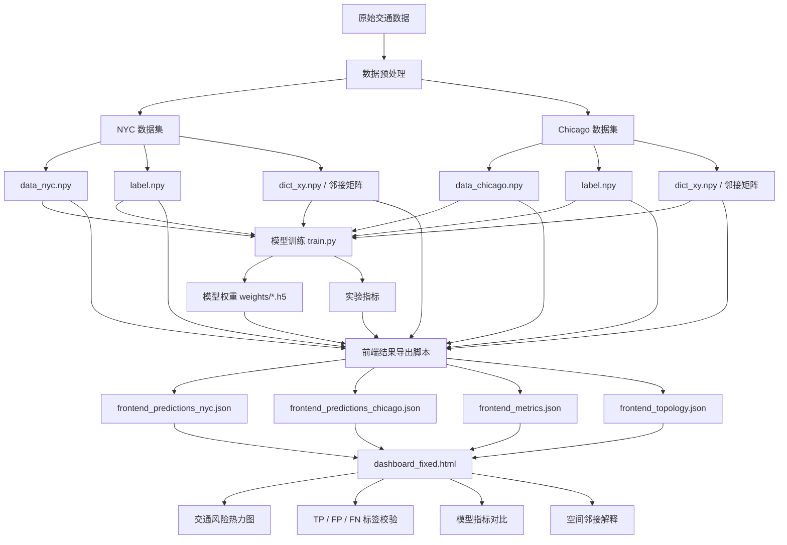
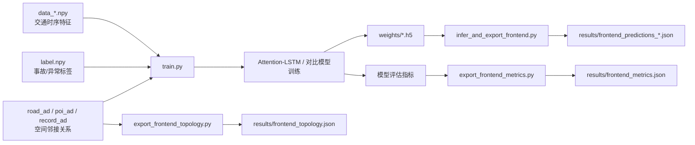
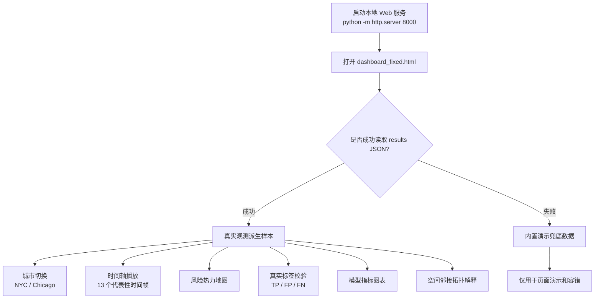
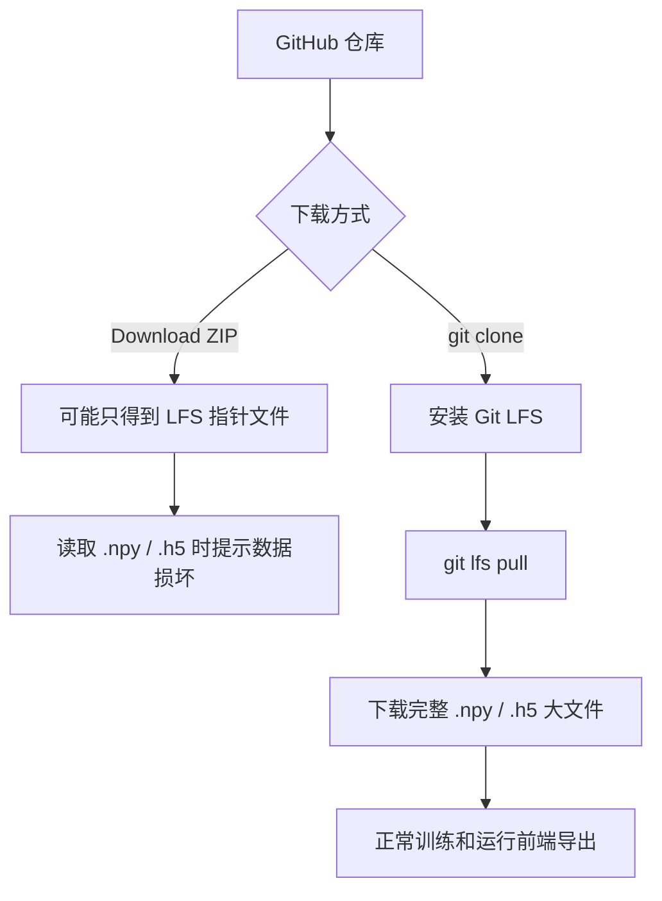
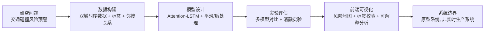

# 项目流程图

## 总体流程

```mermaid
flowchart TD
    A[原始交通数据] --> B[数据预处理]
    B --> C1[NYC 数据集]
    B --> C2[Chicago 数据集]

    C1 --> D1[data_nyc.npy]
    C1 --> E1[label.npy]
    C1 --> F1[dict_xy.npy / 邻接矩阵]

    C2 --> D2[data_chicago.npy]
    C2 --> E2[label.npy]
    C2 --> F2[dict_xy.npy / 邻接矩阵]

    D1 --> G[模型训练 train.py]
    E1 --> G
    F1 --> G
    D2 --> G
    E2 --> G
    F2 --> G

    G --> H[模型权重 weights/*.h5]
    G --> I[实验指标]

    H --> J[前端结果导出脚本]
    I --> J
    D1 --> J
    D2 --> J
    E1 --> J
    E2 --> J
    F1 --> J
    F2 --> J

    J --> K1[frontend_predictions_nyc.json]
    J --> K2[frontend_predictions_chicago.json]
    J --> K3[frontend_metrics.json]
    J --> K4[frontend_topology.json]

    K1 --> L[dashboard_fixed.html]
    K2 --> L
    K3 --> L
    K4 --> L

    L --> M[交通风险热力图]
    L --> N[TP / FP / FN 标签校验]
    L --> O[模型指标对比]
    L --> P[空间邻接解释]
```

## 训练与导出流程

```mermaid
flowchart LR
    A[data_*.npy<br/>交通时序特征] --> D[train.py]
    B[label.npy<br/>事故/异常标签] --> D
    C[road_ad / poi_ad / record_ad<br/>空间邻接关系] --> D

    D --> E[Attention-LSTM / 对比模型训练]
    E --> F[weights/*.h5]
    E --> G[模型评估指标]

    F --> H[infer_and_export_frontend.py]
    G --> I[export_frontend_metrics.py]
    C --> J[export_frontend_topology.py]

    H --> K[results/frontend_predictions_*.json]
    I --> L[results/frontend_metrics.json]
    J --> M[results/frontend_topology.json]
```

## 前端展示流程

```mermaid
flowchart TD
    A[启动本地 Web 服务<br/>python -m http.server 8000] --> B[打开 dashboard_fixed.html]

    B --> C{是否成功读取 results JSON?}

    C -->|成功| D[真实观测派生样本]
    C -->|失败| E[内置演示兜底数据]

    D --> F[城市切换<br/>NYC / Chicago]
    D --> G[时间轴播放<br/>13 个代表性时间帧]
    D --> H[风险热力地图]
    D --> I[真实标签校验<br/>TP / FP / FN]
    D --> J[模型指标图表]
    D --> K[空间邻接拓扑解释]

    E --> L[仅用于页面演示和容错]
```

## GitHub 协作下载流程

```mermaid
flowchart TD
    A[GitHub 仓库] --> B{下载方式}

    B -->|Download ZIP| C[可能只得到 LFS 指针文件]
    C --> D[读取 .npy / .h5 时提示数据损坏]

    B -->|git clone| E[安装 Git LFS]
    E --> F[git lfs pull]
    F --> G[下载完整 .npy / .h5 大文件]
    G --> H[正常训练和运行前端导出]
```

## 答辩讲解顺序

```mermaid
flowchart LR
    A[研究问题<br/>交通碰撞风险预警] --> B[数据构建<br/>双城时序数据 + 标签 + 邻接关系]
    B --> C[模型设计<br/>Attention-LSTM + 平滑/后处理]
    C --> D[实验评估<br/>多模型对比 + 消融实验]
    D --> E[前端可视化<br/>风险地图 + 标签校验 + 可解释分析]
    E --> F[系统边界<br/>原型系统, 非实时生产系统]
```
