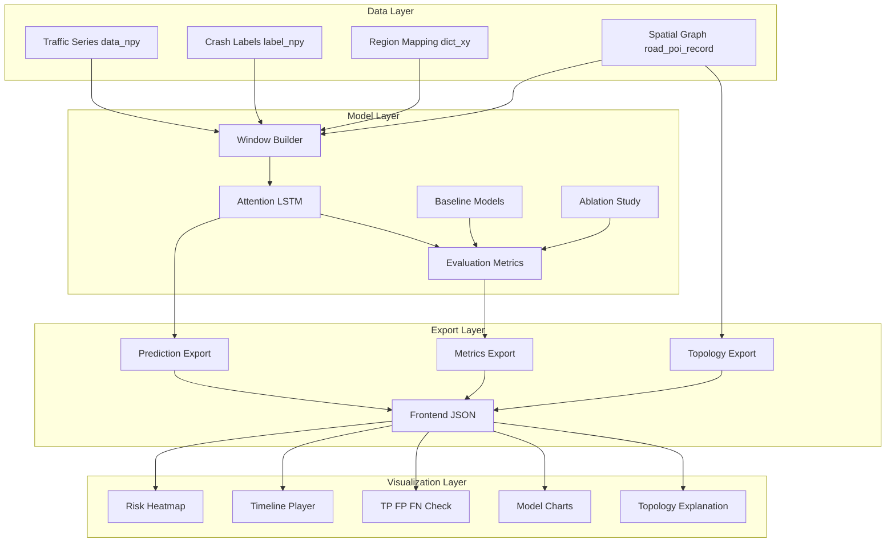
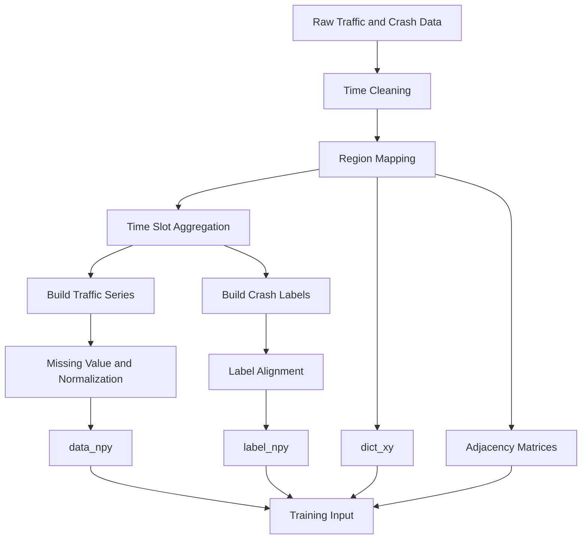
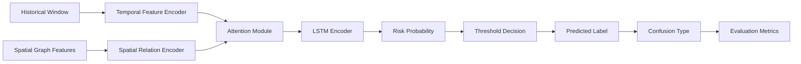
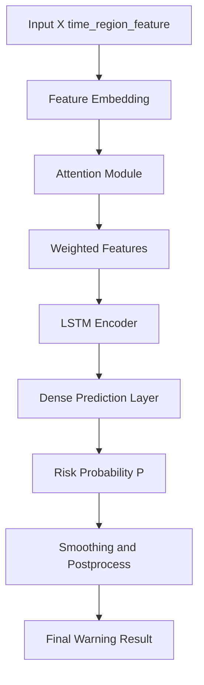
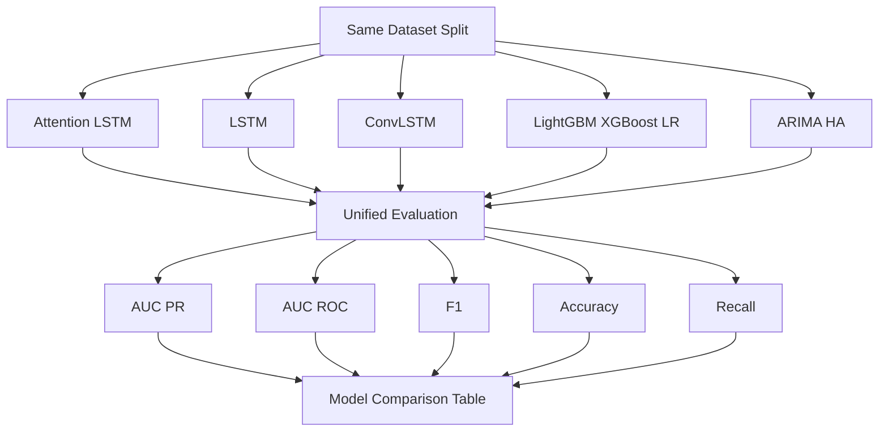
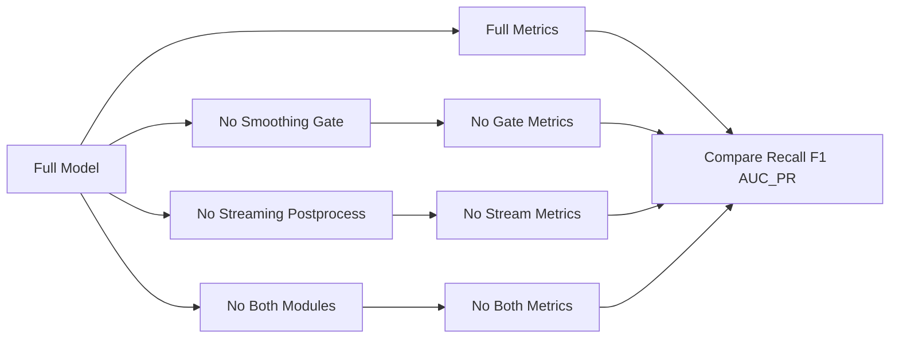
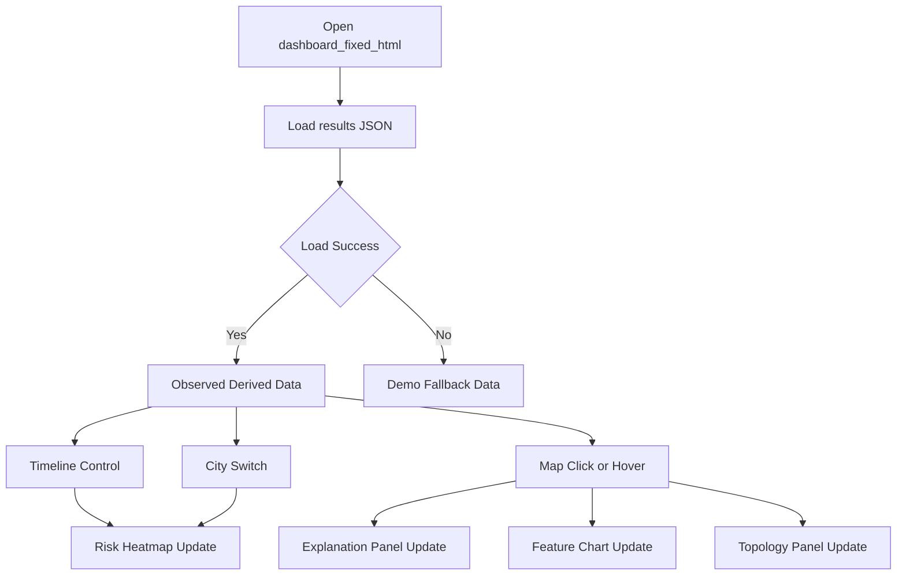
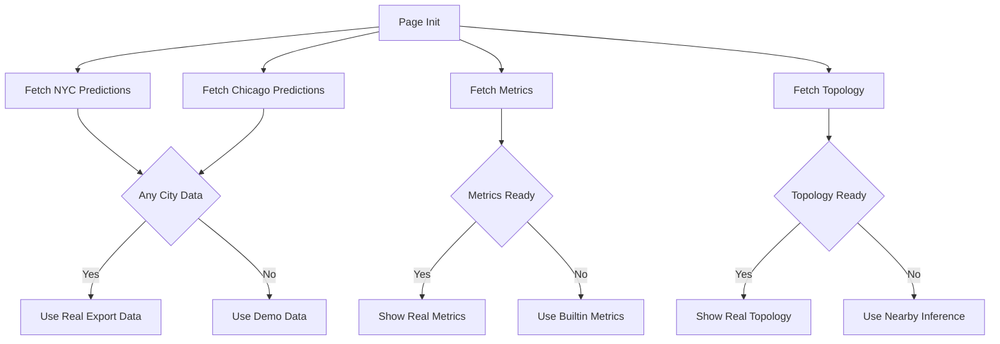
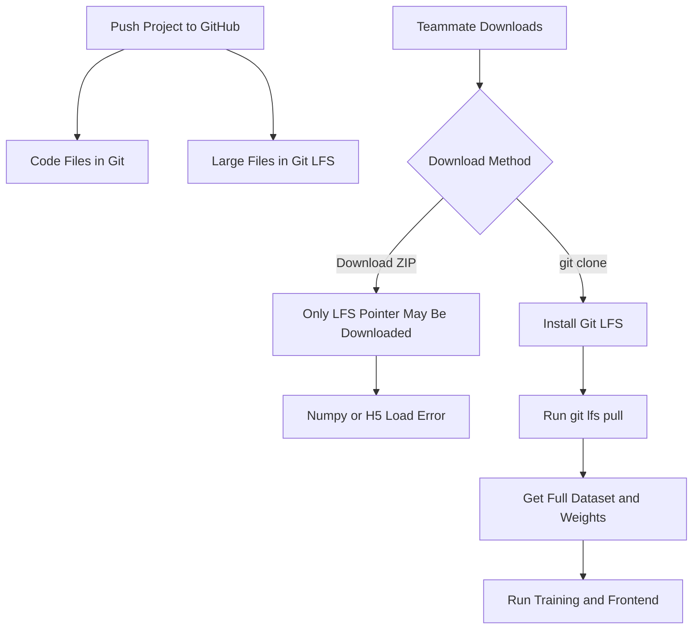
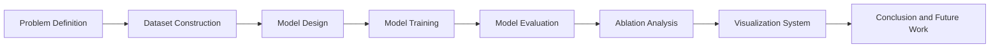

# 论文图表汇总

说明：下面的 Mermaid 图尽量使用简单英文节点，避免中文编码、斜杠、HTML 换行等导致 VS Code 预览失败。论文正文中可以用中文图名，图内部保留英文缩写即可。

## 图 1 系统总体架构图

## 图 2 数据预处理流程图

## 图 3 模型训练流程图

## 图 4 Attention-LSTM 模型结构图

## 图 5 实验对比流程图

## 图 6 消融实验设计图

## 图 7 前端可视化交互流程图

## 图 8 前端数据加载与兜底机制

## 图 9 GitHub 协作与 Git LFS 流程图

## 图 10 论文技术路线图

## 建议放入论文的图片清单

| 编号 | 图名 | 建议章节 | 当前文件 |
| --- | --- | --- | --- |
| 图 1 | 系统总体架构图 | 系统设计 | 本文档 Mermaid |
| 图 2 | 数据预处理流程图 | 数据集构建 | 本文档 Mermaid |
| 图 3 | 模型训练流程图 | 模型方法 | 本文档 Mermaid |
| 图 4 | Attention-LSTM 模型结构图 | 模型方法 | 本文档 Mermaid |
| 图 5 | 实验对比流程图 | 实验设计 | 本文档 Mermaid |
| 图 6 | 消融实验设计图 | 实验分析 | 本文档 Mermaid |
| 图 7 | 前端可视化交互流程图 | 系统实现 | 本文档 Mermaid |
| 图 8 | 前端数据加载与兜底机制 | 系统实现 | 本文档 Mermaid |
| 图 9 | GitHub 与 Git LFS 协作流程图 | 项目部署/附录 | 本文档 Mermaid |
| 图 10 | 论文技术路线图 | 绪论/技术路线 | 本文档 Mermaid |
| 图 11 | 项目介绍图 | 封面/PPT/README | `assets/project-intro.png` |
| 图 12 | 模型结构 PNG | 模型方法 | `assets/paper-model-structure.png` |
| 图 13 | 数据集构建 PNG | 数据集构建 | `assets/paper-dataset-construction.png` |
| 图 14 | 实验结果对比 PNG | 实验分析 | `assets/paper-experiment-comparison.png` |
| 图 15 | 消融实验 PNG | 实验分析 | `assets/paper-ablation-study.png` |
| 图 16 | 部署运行流程 PNG | 项目部署/附录 | `assets/paper-deployment-workflow.png` |
| 图 17 | 真实前端页面截图 | 系统实现 | `assets/frontend-real-screenshot.png` |
